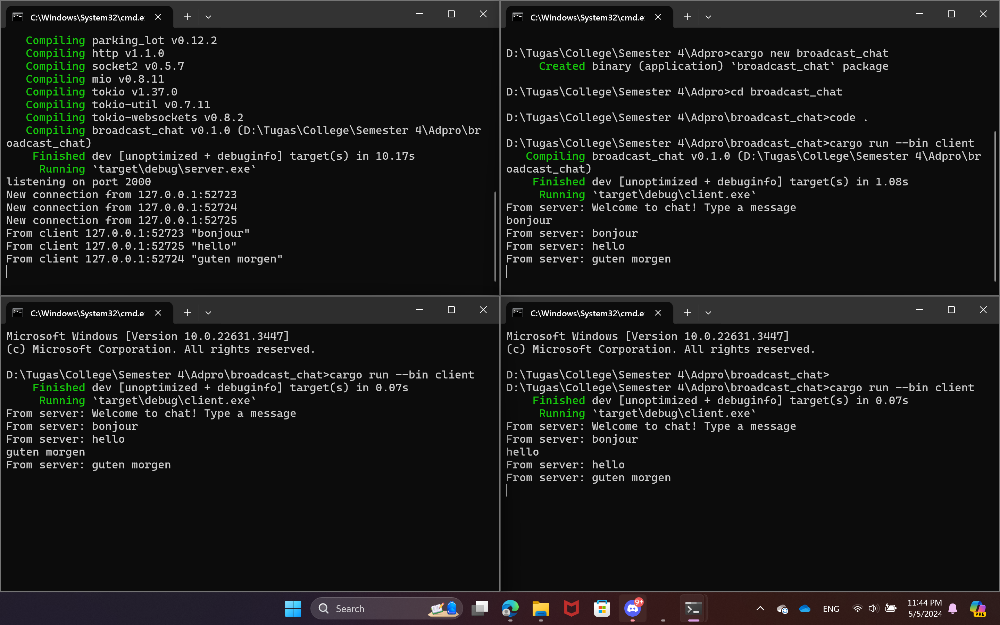

# Tutorial 10 - Reflection
> Fathan Naufal Adhitama - 2206825965 - Pemrograman Lanjut A

## Original code, and how it run

Pada gambar di atas, terlihat saya coba menjalankan 1 server (pojok kiri) dan 3 client (3 window lainnya) pada terminal yang berbeda. Server dijalankan dengan perintah `cargo run --bin server` sementara client dengan perintah `cargo run --bin client` di tiap terminal. Setelah itu, terlihat pada window server bahwa terdapat 3 connection dari 3 client dengan port yang berbeda-beda dan ketika saya mencoba memasukkan message di salah satu client, message akan di-broadcast ke client lainnya oleh server.