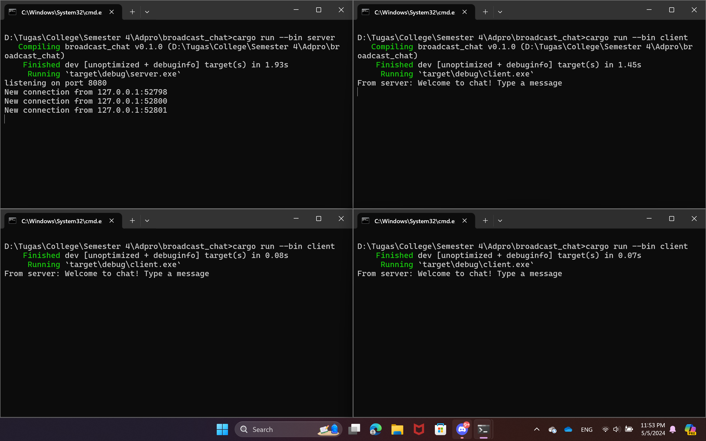
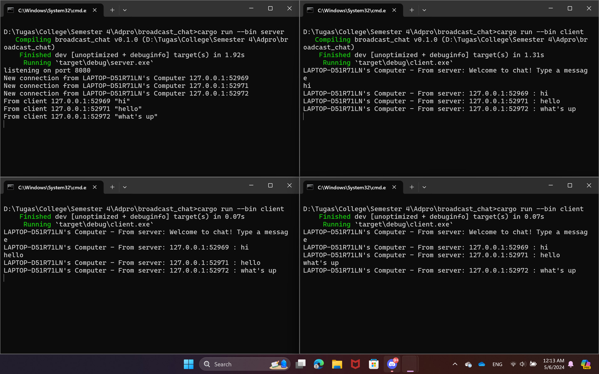

# Tutorial 10 - Reflection
> Fathan Naufal Adhitama - 2206825965 - Pemrograman Lanjut A

## 2.1 Original code, and how it run

Pada gambar di atas, terlihat saya coba menjalankan 1 server (pojok kiri) dan 3 client (3 window lainnya) pada terminal yang berbeda. Server dijalankan dengan perintah `cargo run --bin server` sementara client dengan perintah `cargo run --bin client` di tiap terminal. Setelah itu, terlihat pada window server bahwa terdapat 3 connection dari 3 client dengan port yang berbeda-beda dan ketika saya mencoba memasukkan message di salah satu client, message akan di-broadcast ke client lainnya oleh server.

## 2.2 Modifying the websocket port

Setelah mencoba untuk mengganti port dari 2000 menjadi 8080 pada kedua file (client dan server),  alhamdulillah program tetap berjalan dengan baik. Ini terjadi karena sisi server dan sisi client menggunakan port yang sama. Karena jika portnya berbeda, client tidak dapat menemukan port yang tepat dan program tidak akan berjalan seperti semestinya.

## 2.3: Small changes, add IP and Port

Pada gambar di atas, saya mencoba untuk menambah informasi sender ke setiap client dengan menambahkan informasi nama host-nya yaitu komputer saya (LAPTOP-D51R71LN). Saya melakukan hal tersebut dengan menggunakan dependency baru yaitu `gethostname`. Kemudian dependency tersebut diterapkan untuk memodifikasi perintah print pada server dan client untuk menambah hostname dan menghasilkan program yang berjalan seperti gambar di atas.